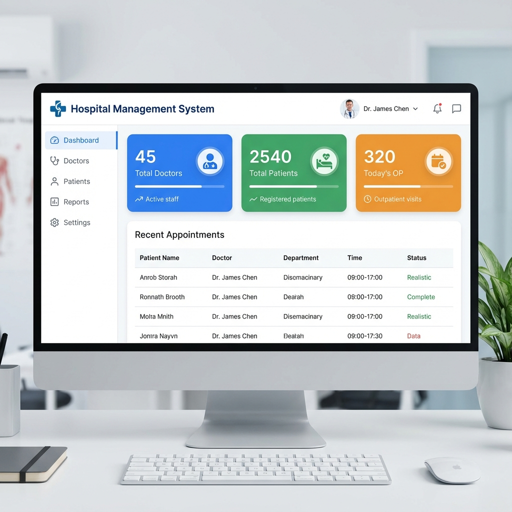
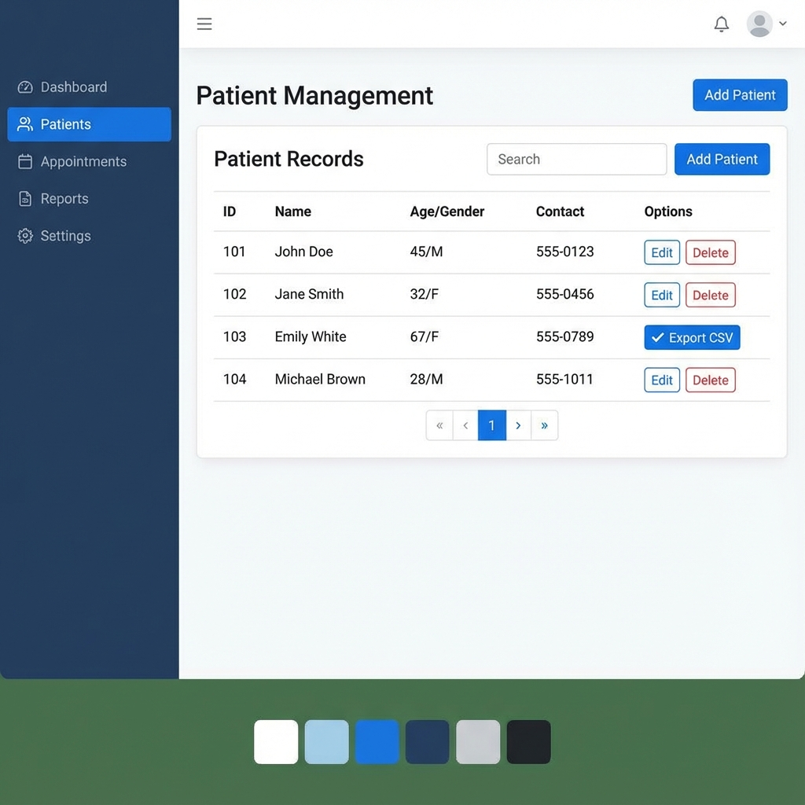
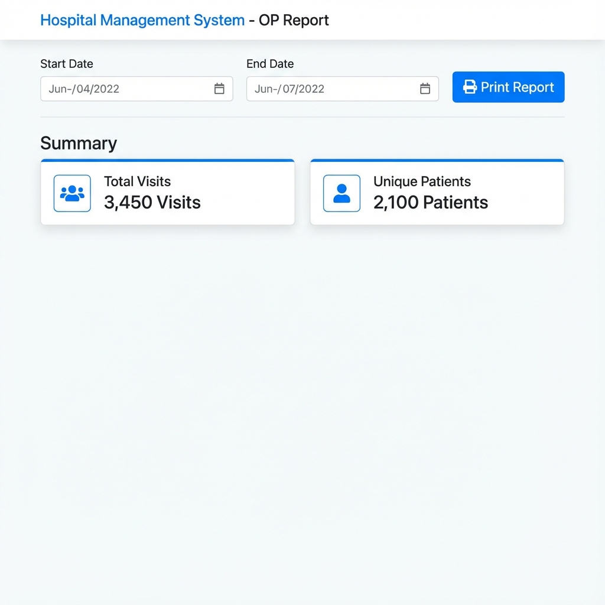

# Hospital Management System

A comprehensive web-based application for managing hospital outpatient (OP) records, doctors, and patient history. Built with PHP, MySQL, and Bootstrap 5.

## Screenshots

  
  
<em>Admin Dashboard</em>

  
  
<em>Patient Records with Search & Export</em>

  
  
<em>Reports & Printing</em>

## 1. Overview
The **Hospital Management System** is designed to streamline the daily operations of a clinic or hospital. It allows administrators and receptionists to manage patient registrations, doctor profiles, and outpatient visits efficiently. The system focuses on ease of use, data integrity, and quick access to patient history.

## 2. Features
*   **Secure Authentication**: Role-based login (Admin, Doctor, Receptionist) with secure session management.
*   **Dashboard**: Real-time overview of total doctors, patients, and today's visits.
*   **Doctor Management**:
    *   Add, Edit, and Delete doctor profiles.
    *   Manage specializations and schedules.
*   **Patient Management**:
    *   Register new patients with demographics (Name, Age, Contact, Address).
    *   **Duplicate Check**: Real-time validation to prevent duplicate phone numbers.
    *   **OP Visits**: Record daily visits with vitals (Weight, BP), symptoms, and notes.
    *   **Patient History**: View and export complete visit history for any patient.
*   **Search & Filtering**:
    *   Global search for patients by Name or Phone Number.
    *   Select2 integration for searchable doctor/patient dropdowns.
*   **Reports & Exports**:
    *   Generate daily/monthly OP reports.
    *   **Export CSV**: Download data for Doctors, Patients, and individual Patient History.
    *   **Print**: Receipt-style print/PDF generation for visits and reports with hospital branding.
*   **Dynamic Settings**: Configure hospital name, address, and additional custom fields for OP forms.

## 3. Requirements
To run this project locally, you need a web server environment with PHP and MySQL.

*   **Software**: XAMPP (recommended), WAMP, or any Apache/NGINX server with PHP 8.x and MySQL 8.x.
*   **Browser**: Modern web browser (Chrome, Edge, Firefox).

## 4. Instructions (Installation)

1.  **Download & Extract**:
    *   Place the `hospital_management_system` folder inside your server's root directory (e.g., `C:\xampp\htdocs\` or `E:\xampp_lite_8_4\www\`).
2.  **Import Database**:
    *   Open phpMyAdmin (`http://localhost/phpmyadmin`).
    *   Create a new database named `hospital_db`.
    *   Import the `database.sql` file provided in the project root.
3.  **Configure Connection**:
    *   Open `config/db.php`.
    *   Update the `$host`, `$dbname`, `$username`, and `$password` variables according to your local setup.
    *   *Default*: Host: `localhost`, User: `root`, Pass: `` (empty).
4.  **Run**:
    *   Open your browser and navigate to:
        `http://localhost/hospital_management_system/`

---

> [!IMPORTANT]
> **!!!!!CLOSE FRAME TO TEST LIVE!!!!!**

### Default Credentials
*   **Username**: `admin`
*   **Password**: `admin123`

